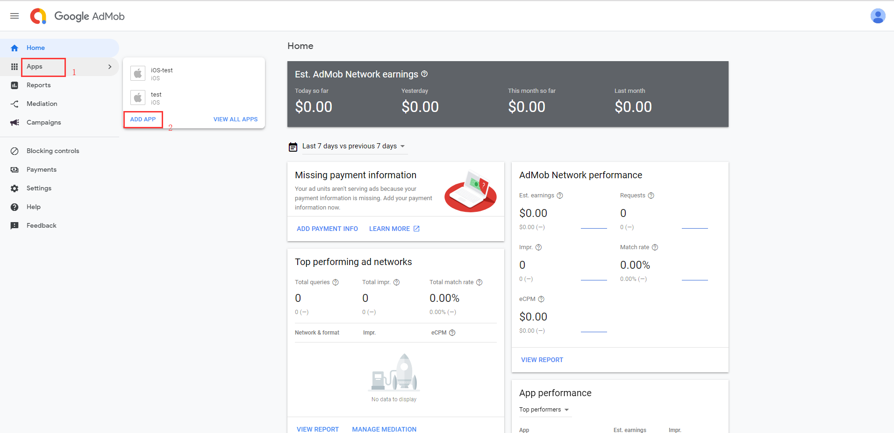
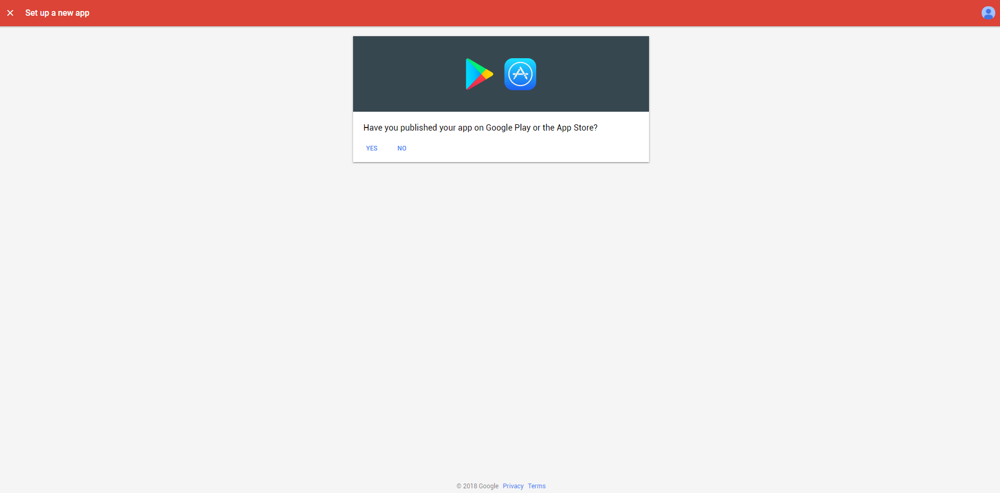
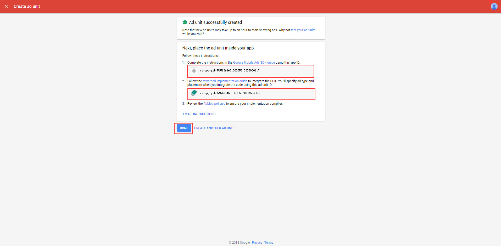
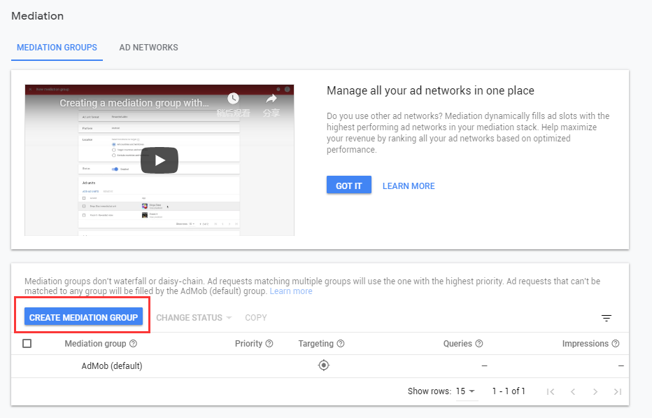
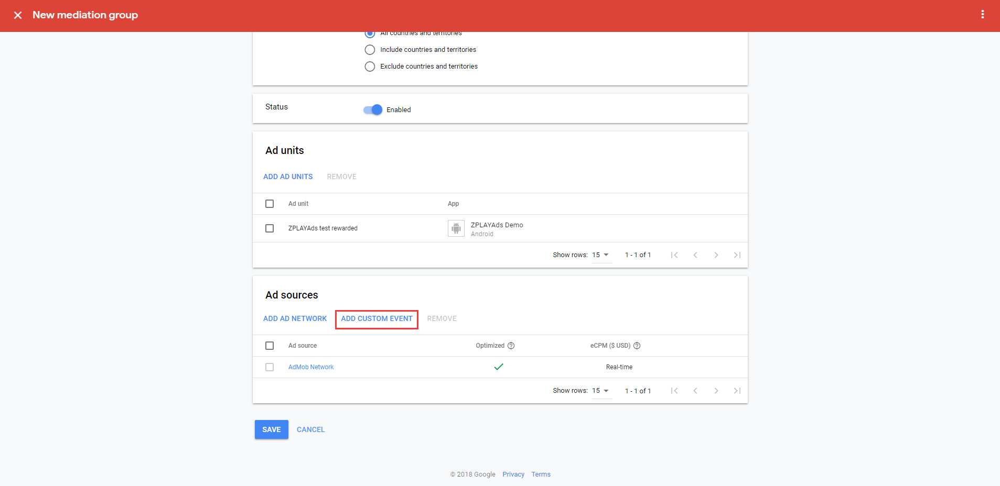

- [1 Integrate Atmosplay Ads SDK and AdMob SDK](#1-integrate-atmosplay-ads-sdk-and-admob-sdk)
  - [1.1 Add Atmosplay Ads SDK Dependence](#11-add-atmosplay-ads-sdk-dependence)
  - [1.2 Add AdMob Ads SDK Dependence](#12-add-admob-ads-sdk-dependence)
  - [1.3 Add permission into AndroidManifest](#13-add-permission-into-androidmanifest)
  - [1.4 Import Atmosplay Ads Adapter into project](#14-import-atmosplay-ads-adapter-into-project)
- [2 Add Atmosplay Ads as a New Network on AdMob](#2-add-atmosplay-ads-as-a-new-network-on-admob)
  - [2.1 Add New App](#21-add-new-app)
  - [2.2 Add New Ad Unit](#22-add-new-ad-unit)
  - [2.3 Add Atmosplay Ads as a New Network on AdMob](#23-add-atmosplay-ads-as-a-new-network-on-admob)
- [3 Test](#3-Test)

## 1 Integrate Atmosplay Ads SDK and AdMob SDK
Using Android Studio as an example, here are some major steps. Please refer to [AdMob SDK Integration Guide](https://developers.google.com/admob/android/quick-start) when integrate AdMob.

### 1.1 Add Atmosplay Ads SDK Dependence

Add dependence in the build.gradle file of app module:

```
dependencies {
    implementation 'com.atmosplayads:atmosplayads:3.0.0'
}
```

### 1.2 Add AdMob Ads SDK Dependence

a. Add maven repository in the build.gradle, which locates in the root directory:

```
maven {
    url "https://maven.google.com"
}
```
And make it look like follows:
```
allprojects {
    repositories {
        maven {
            url "https://maven.google.com"
        }
    }
}
```
b. Add dependence in the build.gradle file of app module
```
dependencies {
    implementation 'com.google.android.gms:play-services-ads:17.2.0'
}
```

About integrating of AdMob, please refers to [Official Documentation](https://developers.google.com/admob/android/quick-start#import_the_mobile_ads_sdk)

### 1.3 Add permission into AndroidManifest
```xml
<!-- Required for China-Mainland Traffic app -->
<uses-permission android:name="android.permission.READ_PHONE_STATE" />
```

### 1.4 Import Atmosplay Ads Adapter into project 
Bannder Adapter：[AtmosplayAdsBanner.java](./admobadapter/src/main/java/com/atmosplayads/admobadapter/AtmosplayAdsBanner.java)

Interstitial Adapter：[AtmosplayAdsInterstitial.java](./admobadapter/src/main/java/com/atmosplayads/admobadapter/AtmosplayAdsInterstitial.java)

Rewarded Video Adapter：[AtmosplayAdsRewardedVideo.java](./admobadapter/src/main/java/com/atmosplayads/admobadapter/AtmosplayAdsRewardedVideo.java)

Admob Rewarded old Custom Events Adapter：[AtmosplayAdsRewardedVideoLegacy.java](./admobadapter/src/main/java/com/atmosplayads/admobadapter/AtmosplayAdsRewardedVideoLegacy.java)

Util Class(which contains some common methods, such as parsing the json issued by AdMob, or converting the error code)：[AtmosplayAdsUtil.java](./admobadapter/src/main/java/com/atmosplayads/admobadapter/AtmosplayAdsUtil.java)

> If you want to know more about Adapter and Request, please refer to the code sample in [DEMO](https://github.com/Atmosplay/AdMobAdapter-AtmosplayAds-Android).

## 2 Add Atmosplay Ads as a New Network on [AdMob](https://apps.admob.com/v2/home)

### 2.1 Add New App

a. Click "Apps" in the menu bar, and then click "ADD APP" button. 


b. Choose whether your app has published in Google Play or App Store. If your App has been published in Google Play or App Store, choose "YES", otherwise choose "NO", here take unpublished as an example.


c. Enter your app information and choose a platform, and click "ADD" to add an app.


### 2.2 Add New Ad Unit

a. After you add an App, click "NEXT: CREATE AD UNIT" button to create an ad unit for this App


b. Choose an ad format. Atmosplay Ads supports Banner, Interstitial and Rewarded now. Using Rewarded as an example. 


c. Fill in the name of Ad unit, then click "CREATE AD UNIT" to add ad unit.


d. Get app ID and ad unit ID of this ad unit. Click "DONE" to accomplish ad unit creation.


### 2.3 Add Atmosplay Ads as a New Network on AdMob
a. Choose "[Mediation](https://apps.admob.com/v2/mediation/groups/list)" in the menu bar, and click "CREATE MEDIATION GROUP" button.


b. Choose ad format and platform. Atmosplay Ads supports Banner,  Interstitial and Rewarded now. Here take Rewarded as an example. Click "CONTINUE" button to go on.


c. Fill in the name of Mediation and select locations to target. Mediation is only available when the status is Enabled, please make sure that status is Enabled. Click "ADD AD UNITS" to choose ad unit. 


d. Choose the app and ad unit you want to configure in the selection box, and click "DONE" to complete configuration.


e. Click "ADD CUSTOM EVENT" to add custom ad sources.


f. Fill in the label of custom ad resource, using Atmosplay Network as an example, you can customize it and set floor price according to your needs. 


g. Configure Atmosplay Network ad source. Fill in full adapter class name in "Class Name" (as the following image shows, the class name in the picture is just a sample, please use the following adapter name), 

Banner's adapter is 
`com.atmosplayads.admobadapter.AtmosplayAdsBanner`, 

Interstitial's adapter is `com.atmosplayads.admobadapter.AtmosplayAdsInterstitial`, 

Rewarded Video's adapter is `com.atmosplayads.admobadapter.AtmosplayAdsRewardedVideo`. 

You need fill in the appId and unitId into the Parameter box, the first one is the [App ID](https://sellers.zplayads.com/#/app/appList/) and the second one is the [Ad Unit ID](https://sellers.zplayads.com/#/ad/placeList/), which you applied on Atmosplay Ads. Click "DONE" to complete configuration.

```json
{"appId":"youAppId","unitId":"yourUnitId"}
```


h. You can see Atmosplay Network in Ad sources list. Click "SAVE" to complete Atmosplay configuration.


i. Check whether third-party ad source has been added successfully. In the [Apps list](https://sellers.zplayads.com/#/app/appList/), find the application and ad unit selected in step d. The active number in the "mediation groups" increased, indicating that the ad source is successfully configured.


## 3 Test 
You are available to use the following ID when testing your App (no charge). Please replace them with the ID you applied in [Atmosplay Ads](https://sellers.zplayads.com/) when you publish your App.

|Ad Format|App_ID|Ad_Unit_id|
|---|---|---|
| Banner | 5C5419C7-A2DE-88BC-A311-C3E7A646F6AF | F22F347B-3D57-0C70-0B13-EFCFDF402EBA |
|Rewarded|5C5419C7-A2DE-88BC-A311-C3E7A646F6AF|3FBEFA05-3A8B-2122-24C7-A87D0BC9FEEC|
|Interstitial|5C5419C7-A2DE-88BC-A311-C3E7A646F6AF|19393189-C4EB-3886-60B9-13B39407064E|
